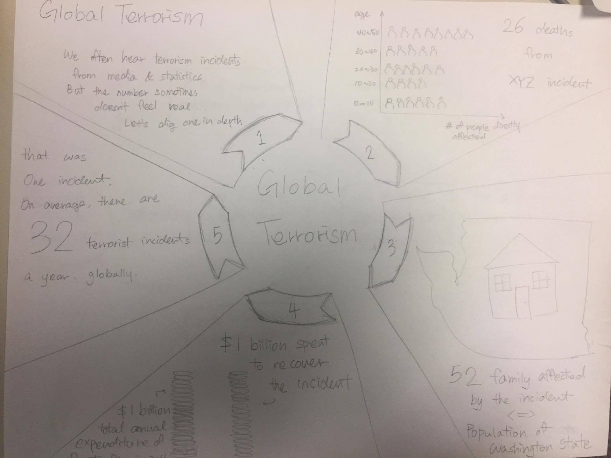

## Partitioned Poster
> 
The partitioned poster provides a story of how impactful terrorist incidents are, by showing the impact of one terrorist incident in depth and showing the average number of incidents happen in a year.   
> - [Visual Narrative]  
> - The poster has a progress bar to direct users to follow through the numbers and arrows. Progress bars are usually used to remind users of how many slides there are and where the user is. Since partitioned poster is just one page, not multiple slides, the bar is used to direct users where to look at first. The poster uses consistent visual platform throughout the partitions to avoid confusing users. Since each partition talks about different aspects of the topic, having a consistent visual platform helps users follow through. Each partition uses Close-ups to highlight important numbers. Since many things go on one page of poster, using different size of text, we highlight important information.   
> - [Narrative Structure]  
> - Since posters are static one-page visualizations, the level of interactivity is very limited, so we decided to use author driven narrative visualization. Instead of having many interactivity, we put many messages on the poster. For example, we have both introuctory text and summary for number 1 and 5 of the partition. We also use headlines to point out important information of each partition. By making it author driven, we can direct the users to the conclusion in our mind, but there is less freedom on users' end. We also use multi-messaging, which is providing related but different information. Each partition have different information, but at the end they are all related.  